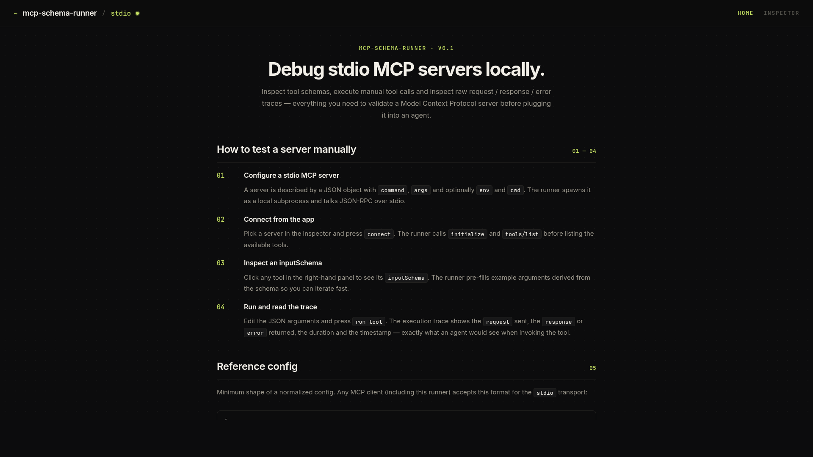

# mcp-schema-runner

mcp-schema-runner is a local developer tool for debugging stdio [Model Context Protocol](https://modelcontextprotocol.io) servers. It inspects the tool schemas a server exposes and lets you execute manual tool calls with custom arguments, inspecting the raw request, response and error trace from the wire. It is designed for engineers who want to validate an MCP server before plugging it into an agent, without writing a test harness.

<p align="center">
  
</p>

## Why this exists

Building an MCP server usually means wiring it into an agent and iterating against opaque tool-call failures in some downstream log. That loop is slow: a single misnamed argument, a missing required field, or a stderr crash surfaces as a generic error in the agent's conversation, far from the actual call. Reproducing the issue locally is awkward — you have to spawn the stdio subprocess by hand, send JSON-RPC, and decode the response.

mcp-schema-runner removes that friction. It spawns the server, runs `initialize` and `tools/list`, exposes the full tool inventory in a focused UI, and lets you invoke each tool with hand-edited JSON arguments while showing the raw request, response and error trace side by side. The same connection an agent would establish, the same JSON-RPC framing, the same payloads — but visible and replayable in milliseconds.

## Highlights

- **Stdio MCP lifecycle**: spawn the server, run `initialize` and `tools/list`, and surface the full tool inventory to the UI.
- **Schema inspection**: read the `inputSchema` of any tool and view a derived summary (type, properties, required) plus the raw JSON.
- **Manual tool calls**: edit JSON arguments by hand, with example payloads pre-filled from the schema, and execute them against the live server.
- **Execution trace**: inspect the `request` sent, the `response` or `error` returned, the duration in milliseconds and the timestamp of every call.
- **Built-in fixtures**: ships with `filesystem`, `context7` and `playwright` configurations so the app is useful out of the box.
- **OpenCode and Hermes compatibility**: normalize external MCP client configurations (OpenCode JSON and Hermes `command`/`args` shape) into the canonical config the runner accepts.
- **Themed dark editor aesthetic**: shared design tokens, custom scrollbars and a design system sourced from the `personal-portfolio` reference.

## Use cases

- Validate that an MCP server starts cleanly under JSON-RPC over stdio before wiring it into an agent.
- Explore the `inputSchema` of every tool without writing a single line of test code.
- Iterate on argument shapes by editing JSON, with the response or error displayed in a monospace trace panel.
- Compare a server's behaviour between two configurations or two argument variants.
- Inspect what a real agent would receive: identical JSON-RPC framing, with full request and response bodies visible.

## Tech stack

- **React 19** — UI runtime.
- **Vite 7** — development server and production build for the client.
- **TanStack Query 5** — server state, polling and mutation cache.
- **Express** — HTTP API for the server process.
- **@modelcontextprotocol/sdk** — stdio transport, `initialize`, `tools/list` and `tools/call`.
- **Vitest** — unit tests for normalize, storage, formatters and hooks.
- **TypeScript 5** — strict type checking on both packages.

## Project structure

```txt
mcp-schema-runner/
├── client/                              # React UI
│   ├── src/
│   │   ├── pages/                       # HomePage and InspectorPage
│   │   ├── components/
│   │   │   ├── primitives/              # Button, Panel, Field, StatusDot, EmptyState, ErrorBanner
│   │   │   ├── shell/                   # AppShell, TopBar, ServerSelect
│   │   │   ├── tools/                   # ToolList, SchemaViewer
│   │   │   └── traces/                  # JsonEditor, ExecutionTrace
│   │   ├── lib/                         # api, hooks, format, router
│   │   └── styles/                      # tokens, reset, globals, scrollbars
├── server/                              # Express + MCP SDK
│   ├── src/
│   │   ├── api/                         # routes.ts
│   │   ├── mcp/                         # manager.ts (StdioClientTransport wrapper)
│   │   ├── config/                      # normalize, expandPaths, fixtures
│   │   └── storage/                     # configStore
├── shared/                              # Cross-package types and fixtures
│   ├── types.ts                         # McpServerConfig, McpServerState, McpToolSummary, ToolExecutionTrace
│   └── fixtures.ts                      # built-in MCP server configs
├── scripts/dev.mjs                      # Orchestrator (API server + Vite client)
├── fixtures-workspace/                  # Target directory for the `filesystem` fixture
├── plan.md                              # 7-phase MVP plan and phase 2/3 roadmap
├── handoff.md                           # Current state, verification steps, suggested skills
└── client/public/                       # Static assets served by Vite and repo-level images
    └── preview.png                      # HomePage screenshot (used in README.md)
```

## Getting started

### Prerequisites

- Node.js 18 or newer
- npm

### Install

The repo is a small monorepo with three workspaces. A single script installs
all of them:

```bash
npm run install:all
```

This runs `npm install` at the root, then in `server/` and `client/`.

### Run locally

```bash
npm run dev
```

The orchestrator script (`scripts/dev.mjs`) starts:

- the Express API on `http://localhost:3001`
- the Vite client on `http://localhost:5173`

The frontend URL is printed to the terminal as an OSC 8 hyperlink so it can
be opened with a single click from most modern terminals.

### Build

```bash
npm run build
```

Builds the server and the client. The client output is in `client/dist/`.

### Test

```bash
npm test
```

Runs the Vitest suites for both the server (normalize + storage) and the
client (format helpers).

## How to use

1. Pick a server in the **Inspector** — start with the built-in `filesystem` fixture, which points at the bundled `fixtures-workspace/` directory.
2. Press **connect**. The runner spawns the subprocess, runs `initialize` and `tools/list`, and lists the available tools on the left.
3. Click any tool to inspect its `inputSchema`. The runner pre-fills example arguments derived from the schema so you can iterate fast.
4. Edit the JSON arguments, press **run tool** and read the execution trace. The trace shows the raw `request` sent, the `response` or `error` returned, the duration and the timestamp — exactly what an agent would see when invoking the tool.

## Reference config

Any MCP client (including this runner) accepts the following shape for the `stdio` transport:

```json
{
  "id": "filesystem",
  "name": "filesystem",
  "transport": "stdio",
  "command": "npx",
  "args": ["-y", "@modelcontextprotocol/server-filesystem", "/abs/path/to/workspace"]
}
```

The runner also accepts `env` (key/value pairs) and `cwd` (working directory). Configurations from OpenCode (`{type: "local", command: [...]}`) and Hermes (`{command, args?, env?}`) are normalized into this shape automatically; secrets read from external files are redacted on import.

## Endpoints

The Express API exposes:

| Method | Path | Purpose |
|---|---|---|
| `GET` | `/api/health` | Liveness probe. |
| `GET` | `/api/servers` | List fixtures merged with persisted user servers. |
| `POST` | `/api/servers` | Add a new server configuration (validated). |
| `DELETE` | `/api/servers/:id` | Remove and disconnect. |
| `POST` | `/api/servers/:id/connect` | Spawn stdio + `initialize` + `tools/list`. |
| `POST` | `/api/servers/:id/disconnect` | Kill the subprocess. |
| `GET` | `/api/servers/:id/tools` | Refresh the tool inventory. |
| `POST` | `/api/servers/:id/tools/:toolName/call` | Execute a tool call and return a trace. |

The MCP client is the only piece allowed to spawn processes, and it never auto-connects at boot: every connection is an explicit POST from the UI. Graceful `SIGINT`/`SIGTERM` closes all processes before exiting.

## Notes

- Only the `stdio` transport is implemented in the MVP. The `SSE`/`HTTP` transports tracked in `plan.md` (Phase 3) are out of scope for the current release.
- The runner never auto-connects to any server on startup, including the built-in fixtures. Connections are always explicit.
- `fixtures-workspace/` ships with a `hello.txt` and a `README.md` so the end-to-end smoke test in `handoff.md` works against a fresh clone with no extra setup.
- The Inspector only spawns a subprocess after the user clicks **connect**. The UI never holds a connection silently.

## Documentation

Useful references:

- [`plan.md`](plan.md) — 7-phase MVP plan and the Phase 2/3 roadmap.
- [`handoff.md`](handoff.md) — current state, verification steps, suggested skills for a fresh agent.

## References

External links that informed this project:

- [Model Context Protocol specification](https://modelcontextprotocol.io) — the protocol this runner targets.
- [MCP TypeScript SDK](https://github.com/modelcontextprotocol/typescript-sdk) — `@modelcontextprotocol/sdk`, the stdio transport and JSON-RPC implementation wrapped by the server.
- [OpenCode](https://opencode.ai) — one of the two external MCP client formats the normalizer accepts.
- [Hermes](https://github.com/input-output-hk/hermes) — the other external MCP client format the normalizer accepts.
- [Express](https://expressjs.com) — the HTTP layer used by the server.
- [TanStack Query](https://tanstack.com/query) — the server-state library used by the React client.
- [Vite](https://vitejs.dev) — the dev server and bundler for the client.

## License

MIT. See [`LICENSE`](LICENSE).
